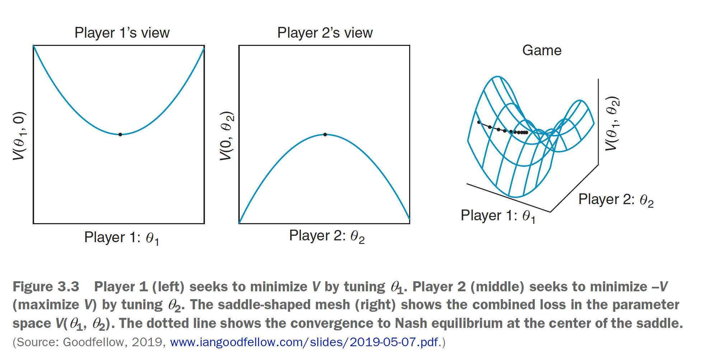
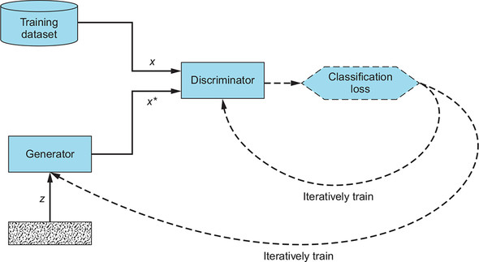

# programming-gans

Generative Adversarial networks are minimax games in which a generator (smooth criminal) tries to fool a discriminator (the cops) into believing the world is flat. 

 

> Because the Generator and Discriminator can tune only their own parameters and not each other’s, GAN training can be better described as a game, rather than optimization.

> GANs consist of two networks whose cost functions are dependent on both of the networks’ parameters. 

In this zero-sum game, eventually neither player can improve their position with any actions. This happens when both the generator discriminator can no further minimize the loss of the parameters under their control.

The [Nash equilibrium](https://www.investopedia.com/terms/n/nash-equilibrium.asp#:~:text=The%20Nash%20equilibrium%20is%20a%20decision%2Dmaking%20theorem%20within%20game,the%20decisions%20of%20other%20players.) brings training to completion when: 
  * the generator makes perfect fakes
  * the discriminator has a 50/50 chance of identifying real or fake

At that point the generator can only decrease the quality of its outputs by making changes to its routine. 

| Gan Confusion Matrix |
| ----- |
| Input | Discrimintator Close to 1 | Discriminator Close to 0 |
| ---- | ---- | ---| 
|Real (x) | Positive Postive | False Positive |
| Fake (*x) | False Positive | Positive Negative 

